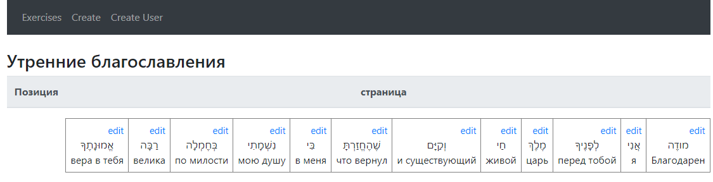

interli - interlinear translation for any texts

​

инструкция по запуску

1. npm install
2. npm start
3. переходим в терминале в папку backend
4. node serve

This project was bootstrapped with [Create React App](https://github.com/facebook/create-react-app).

 