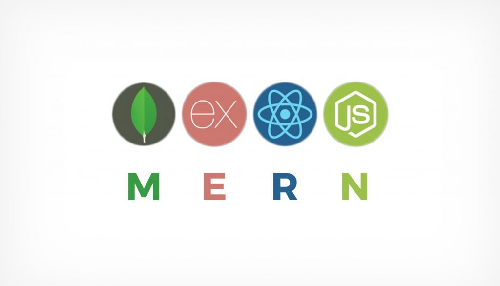

# InterLi - interlinear translation for any texts

 

 
## installation instructions

1. npm install
2. npm start
3. go to the backend folder in the terminal (cd backend)
4. npm start serve

 
This project was bootstrapped with [Create React App](https://github.com/facebook/create-react-app).

## this project used

1. MongoDB
2. Express
3. React
4. Node 
 

